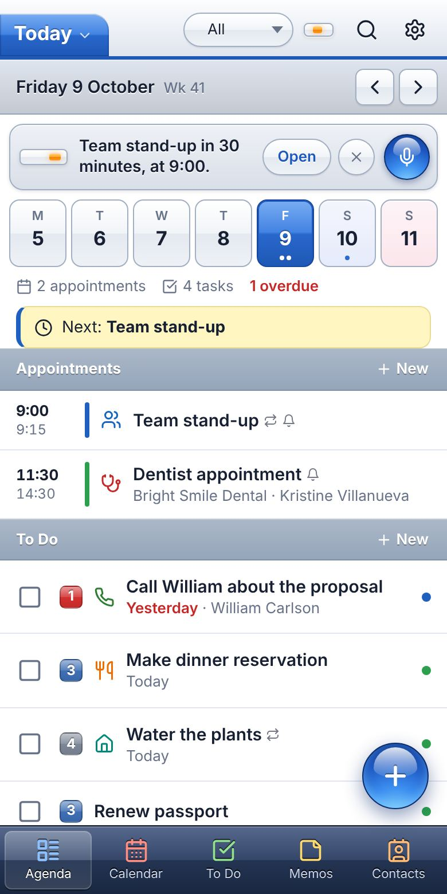
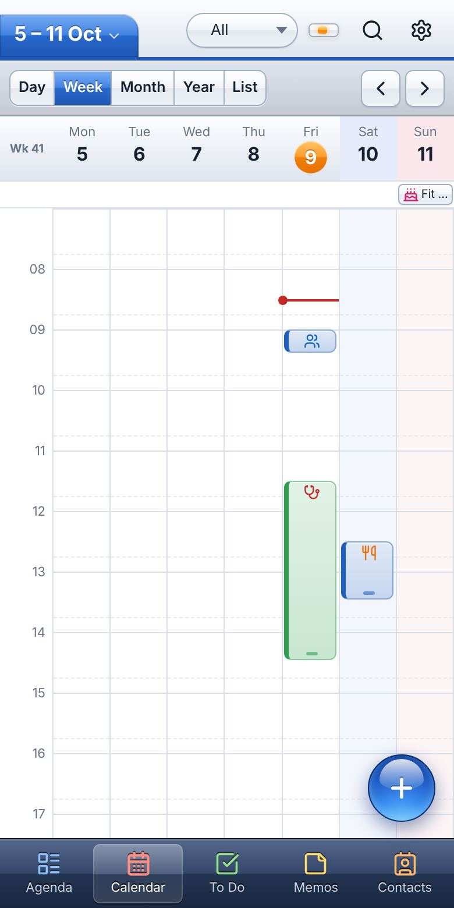
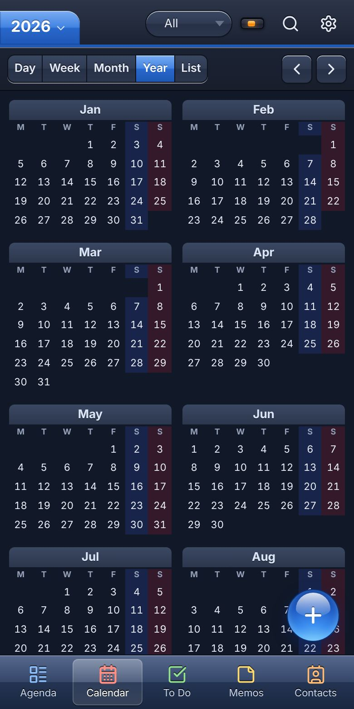
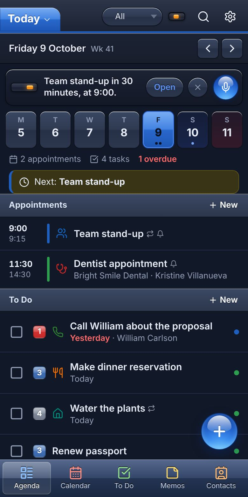
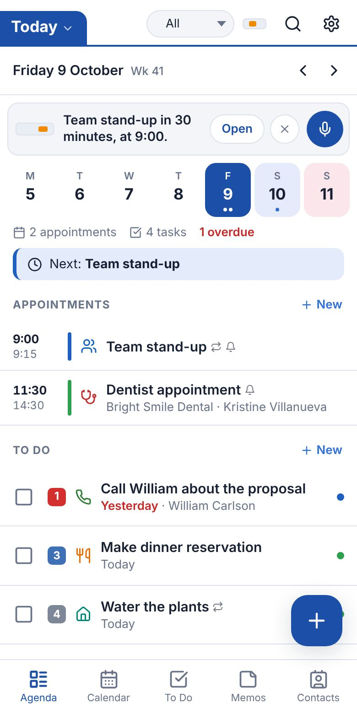
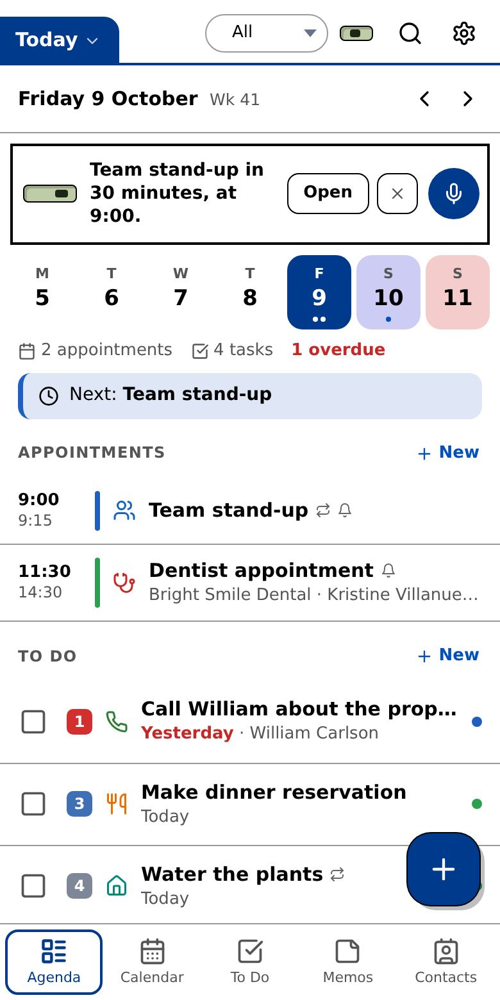

# PalmOS Agenda

The classic Palm OS organizer, rebuilt for your phone. A tribute to **Agendus** by Iambic, the agenda app many Palm users lived in. Appointments, tasks, contacts and memos in one place, with the Agenda screen that made Agendus famous: everything you need for today on one page.

It's a Progressive Web App. Open it in a browser, add it to your home screen, and it works offline. No account needed: your data stays on your device. Want the same agenda on your phone and laptop? Run the small sync server in `server/` on your own VPS.

**[Try the demo](https://rheijmen.github.io/palmOS/?demo#/agenda)** (opens with sample appointments, nothing to install) · **[About the project](https://rheijmen.github.io/palmOS/about.html)** · **[Help build it](CONTRIBUTING.md)**

<p>
  
  
  
</p>

## Looks like 2007, thinks like 2027

Meet **Pilot**, a K.I.T.T.-style assistant that actually works. Like the talking car from Knight Rider: smart, a bit chatty, with a reassuringly simple interface. It speaks first (what's next, clashes, overdue tasks), does the work ("move my dentist to Friday", with one tap to undo), and listens and talks back. Simple commands work offline; for free conversation you add your own AI key, which stays on your device.

## Style is everything

| 2007 light and night | Modern | Classic Palm |
| --- | --- | --- |
|   |  |  |
| Aqua is the GOAT | Looks like anything these days | Your minimalistic friend |

## Looking for collaborators

This is a hobby project that would love company: developers, designers, translators and Palm veterans with memories (or screenshots) of the original. Ideas on the wish list include more languages, accessibility, CalDAV sync, end-to-end encrypted sync and a wide "Palm Desktop" layout. See [CONTRIBUTING.md](CONTRIBUTING.md) to get started, or open an issue to say hi.

## Features

**Agenda (today screen)**
- Week strip with busy dots, today's appointments, tasks (including overdue), birthdays, and the people you're dealing with today, with one-tap call / text / email
- "Now / Next" indicator and a look ahead at the coming days

**Calendar views**
- Day: time grid with overlapping appointments side by side, a "now" line, tap an empty hour to add
- Week: 7-column time grid with icons, weekend shading, all-day row
- Month: icons and titles per day, with the selected day's agenda below the grid
- Year: 12 mini months with Saturday/Sunday shading and busy days highlighted (like the Agendus year view)
- List: chronological list of everything coming up
- Swipe left/right to move through dates, tap the title tab to jump to any date

**Appointments**
- Icons (47 colour icons, Agendus style), categories with colours, location, notes
- All-day and multi-day appointments
- Repeating: daily, weekly (pick days), monthly by date or by weekday ("last Friday"), yearly, every N, until a date
- Edit or delete just one occurrence, this and future ones, or all
- Link contacts, duplicate, create a follow-up

**Alarms**
- Agendus-style reminder with Snooze and Follow-up (task tomorrow, task next week, appointment next week)
- System notifications (when allowed), plus a short Palm-style chirp

**To Do**
- Priorities 1-5, due dates, categories, icons, linked contacts, notes, reminder time
- Quick add, filters (Open, Due, Upcoming, No date, Completed)
- Repeating tasks roll on to their next date when you check them off

**Contacts**
- Multiple phone numbers and emails, address, birthday (with or without year), company, website
- Contact history: every appointment and task linked to that person
- Birthdays show up in the agenda and calendar automatically

**Memos**
- Memo Pad notes, first line is the title, saved automatically

**Touch controls**
- Day and week view: long-press an appointment and drag it to another time (or another day in the week view); drag its bottom edge to make it longer or shorter; long-press an empty spot and drag to create an appointment for exactly that time range
- Month view: long-press an appointment and drag it to another day
- To Do (and the tasks on the Agenda): swipe right to complete, swipe left to delete, with undo
- Repeating appointments ask whether to move only this one, this and future ones, or all
- With a mouse, everything drags straight away (no long-press needed)
- Haptic feedback on Android, pages slide when you change dates

**Assistant ("Pilot", rename it to whatever you like)**
- Talk to your agenda: tap the little display in the title bar (or press `k`), tap **Talk** and speak, or type
- It reads and changes your agenda for you: "move the dentist to Friday at 3", "what does tomorrow look like?", "remind me to call Kristine after lunch", "text William I'm running late"
- It speaks up by itself: a strip on today's Agenda points out what's next, clashes, days without a break, overdue tasks (with one-tap "move to today"), birthdays and early starts. Opening the assistant reads the news aloud; reminders are spoken too
- Interface: in the 2007 Aqua style, with a nod to the talking cars of 1980s TV. A glossy display shows a light that sweeps while it thinks and an orange three-column visualizer that lights up while it talks; the conversation runs in speech bubbles. Classic Palm gets a green Palm LCD, Modern stays flat
- Every change it makes can be undone with one tap
- Works without AI too: offline it understands "what's next", "today", "tomorrow" and "remind me to..."

To let it understand everything, add a Claude API key in **Preferences > Assistant** (get one at console.anthropic.com, and set a monthly spending limit there). Notes:
- The key is stored on this device only and sent only to Anthropic. It is not in your backups. Fine for a personal app; a public version should route requests through its own server instead.
- Default model is Claude Opus 5.5 at low effort, so answers are quick. Switch to Sonnet 5.5 or Haiku 5.5 (much cheaper) in Preferences. If Claude declines a request, a fallback model takes over automatically.
- Voice uses the browser's built-in speech recognition and voices. On iPhone, the microphone button may be missing in the home-screen app; the keyboard's dictation microphone works everywhere.

**Sync between devices (optional)**
- Sign in under *Preferences > Sync* to keep phones, tablets and computers in step. Changes from other devices appear within seconds while the app is open
- Runs on your own server (PocketBase, one container), so your data stays with you. You create the accounts; each person only sees their own agenda
- Works offline as before: changes wait and go up when you're back online. When the same item was edited on two devices, the latest edit wins
- Your look and language stay per device; preferences such as week start and day hours follow you
- Setup guide: [server/README.md](server/README.md)

**Everything else**
- Global search across appointments, tasks, contacts and memos
- Category filter on every screen
- Undo after deleting or completing
- English and Dutch (follows your device language, or set it in Preferences)
- Looks: **2007 Aqua** (default, glossy 2007-era style, light and night versions), **Modern** (flat), and **Classic Palm** (the green-grey Palm screen)
- Import/export: `.ics` (Google, Apple, Outlook calendars), `.vcf` (contacts), and full JSON backups
- Keyboard shortcuts on desktop: `a` agenda, `d` `w` `m` `y` `l` views, `t` today, arrows to move, `n` new, `/` search, `k` assistant

## Run it locally

Any static web server works. With Node installed:

```bash
npm start
```

Then open http://localhost:8080. (Opening `index.html` directly from disk won't work, because browsers block ES modules on `file://`.)

## Put it online

It's plain static files, so any static host works:

- **GitHub Pages**: Settings > Pages > deploy from the `main` branch, root folder.
- **Vercel / Netlify / Render (static site)**: point it at this repo, no build command, publish directory `.`.

HTTPS is needed for the offline mode and notifications (all of the hosts above provide it).

After deploying an update, bump `VERSION` in `sw.js` so installed apps pick up the new files.

## Good to know

- **Where is my data?** In your browser's local storage on that device, and on your sync server if you signed in. Without sync, use *Preferences > Back up* now and then, and *Restore* to move to another device.
- **Alarms** ring while the app is open or running in the background. Browsers don't let a closed web app wake up at an exact time, so an alarm that was missed while the app was fully closed shows up the next time you open it (up to 6 hours late).

## Tests

```bash
npm install
npm test
```

Runs these checks in a headless phone-sized browser:

- `tests/e2e.mjs`: creating and editing appointments (including a single occurrence of a repeating one), undo, tasks and repeating tasks, contacts and birthdays, search, the back button, date navigation, memo autosave, `.ics`/`.vcf` round trips, the recurrence rules, and a no-horizontal-scroll check on a 360px screen.
- `tests/gestures.mjs`: real touch input for long-press dragging, resizing, create-by-drag, month drag, repeating-appointment moves and task swipes, plus mouse dragging in the week view.
- `tests/assistant.mjs`: offline commands, the API key settings, and the full Claude tool loop against a mocked API (request headers, fallback, tool calls, undo, error handling). No real key needed and nothing is billed.

The sync check needs the PocketBase program ([download](https://pocketbase.io/docs/)) and starts its own throwaway server:

```bash
POCKETBASE=/path/to/pocketbase npm run test:sync
```

- `tests/sync.mjs`: two devices on one account: first upload and download, live updates, edits, deletes, offline changes, conflicts, shared versus per-device preferences, and that switching accounts never mixes data.

## Project structure

```
index.html            App shell
about.html            Project information page
css/app.css           Layout, themes and gesture styles
css/skin-2007.css     The glossy 2007 Aqua look
js/app.js             Routing, title bar, toolbar, global actions
js/store.js           Data, persistence, undo, sample data
js/query.js           Occurrences, filters, search
js/recur.js           Repeat rules
js/editors.js         Detail and edit sheets, pickers, follow-ups
js/reminders.js       Alarms, snooze, notifications
js/gestures.js        Drag, resize and swipe
js/ai/assistant.js    Conversation with Claude, tools, offline commands
js/ai/insights.js     Proactive tips and the spoken briefing
js/ai/panel.js        The dashboard and the Agenda strip
js/ai/voice.js        Speech in/out and the voice box
js/sync.js            Sync with your PocketBase server
js/config.js          Default sync server address
js/vendor/            Anthropic and PocketBase SDKs, bundled for the browser
css/assistant.css     How Pilot looks in each style
js/interop.js         .ics and .vcf import/export
js/i18n.js            Translation and date formatting
js/strings.js         English and Dutch strings
js/views/*.js         Agenda, calendar views, tasks, contacts, memos, preferences
sw.js                 Offline cache
server/               Sync server: Docker setup, database rules, setup guide
```

## License

MIT, see [LICENSE](LICENSE). Third-party parts are listed in [THIRD_PARTY_LICENSES.md](THIRD_PARTY_LICENSES.md).

Agendus was a product of Iambic Inc. Palm and Palm OS are trademarks of their respective owners. This project is an independent tribute and is not affiliated with Iambic or the owners of Palm.
